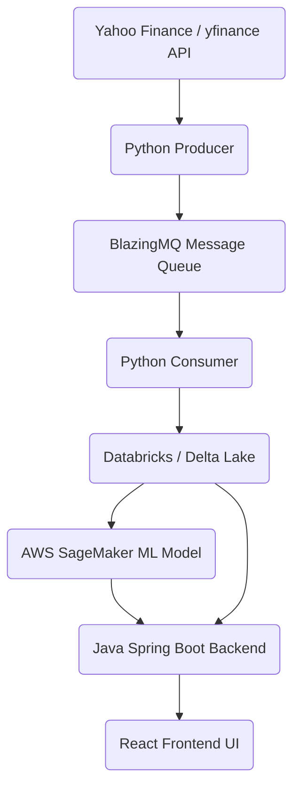

# Research Platform Implementation Plan

> **Concept**: A full-stack, cloud-native application designed to retrieve stock data, queue it using BlazingMQ, process it via Databricks, predict stock prices with AWS SageMaker, and display the results through a Java (Spring Boot) backend and a React frontend, deployed on Azure.
> **Date**: 2026-02-21
> **Goal**: Demonstrate advanced DevOps flow, software architecture, and integrations with Cloud, Databricks, Java, BlazingMQ, and React.

---

## 📋 Table of Contents

1. [Architecture Overview](#1-architecture-overview)
2. [Technology Stack](#2-technology-stack)
3. [Phase 1: Data Pipeline & Queuing (BlazingMQ)](#3-phase-1-data-pipeline--queuing-blazingmq)
4. [Phase 2: Data Processing (Databricks)](#4-phase-2-data-processing-databricks)
5. [Phase 3: Machine Learning (SageMaker)](#5-phase-3-machine-learning-sagemaker)
6. [Phase 4: Backend API (Java Spring Boot)](#6-phase-4-backend-api-java-spring-boot)
7. [Phase 5: Frontend UI (React)](#7-phase-5-frontend-ui-react)
8. [Phase 6: DevOps & Cloud Deployment (Azure)](#8-phase-6-devops--cloud-deployment-azure)

---

## 1. Architecture Overview

### Data Flow
1. **Retrieval**: yfinance Python scripts periodically pull the latest stock pricing and fundamentals data.
2. **Queuing**: The raw data payload is pushed to **BlazingMQ**, ensuring high throughput and decoupled architecture.
3. **Processing**: The data is ingested into **Databricks** (Delta Table) where feature engineering occurs (indicators like SMA, RSI).
4. **Machine Learning**: Processed data is sent to an **AWS SageMaker** prediction endpoint to classify/forecast price movements.
5. **Backend**: A robust **Java Spring Boot** application retrieves ML predictions and structured data.
6. **Frontend**: The **React** frontend fetches this data to render interactive tables and Chart.js graphs.
7. **Cloud**: Built as a containerized solution, the whole stack is intended for seamless **Azure** deployment.

---

## 2. Technology Stack

| Layer | Technology | Purpose |
|---------|------|------|
| **Data Retrieval** | Python `yfinance` | Fetch real-time/historical OHLCV stock data |
| **Message Queue** | BlazingMQ | Robust messaging bus to decouple ingestion |
| **Data Platform** | Databricks | Feature engineering and data consolidation |
| **Machine Learning** | AWS SageMaker (XGBoost) | Price prediction modelling |
| **Backend API** | Java 21 + Spring Boot 3.x | Enterprise RESTful API |
| **Frontend UI** | React 18 + Vite | Interactive dashboard with charts |
| **Infrastructure**| Docker / Github Actions | CI/CD DevOps pipeline integration |
| **Cloud Hosting** | Azure (App Service) | Hosting backend API and frontend static files |

---

## 3. Phase 1: Data Pipeline & Queuing (BlazingMQ)

**Goal**: Fetch external data responsibly and queue it using a resilient message broker.
1. Create a `data_pipeline` module in Python.
2. Formulate scripts that query `yfinance` for selected tickers (e.g., AAPL, MSFT, Sony).
3. Utilize a Bloomberg-style **BlazingMQ** container queue to buffer data ingestion payloads.
4. Establish a consumer script to listen to BlazingMQ and deposit data into Parquet/JSON for Databricks.

---

## 4. Phase 2: Data Processing (Databricks)

**Goal**: Prepare and engineer features from raw OHLCV market data.
1. Push queued raw data into Databricks tables (Delta open-source format).
2. Notebooks `01_data_ingestion.py` and `02_signal_calculation.py` handle technical metric derivations:
   - Simple Moving Averages (20, 50, 200).
   - Relative Strength Index (RSI).
   - Bollinger Bands / Moving Average crossovers.
3. Consolidate and summarize datasets (`03_data_export.py`) for SageMaker and the Java Backend to digest.

---

## 5. Phase 3: Machine Learning (SageMaker)

**Goal**: Offer intelligent stock price predictions by leveraging high-quality cloud ML.
1. The Databricks-engineered features serve as input for AWS SageMaker.
2. Setup a `sagemaker/` directory with `train_xgboost.py` to create binary or regression prediction models that analyze future returns.
3. Deploy this model to a SageMaker Real-Time Endpoint.
4. Integrate the prediction capabilities via Python scripts (or bridging directly to the Spring Boot app).

---

## 6. Phase 4: Backend API (Java Spring Boot)

**Goal**: Secure, typed, and resilient middleware to supply the React frontend.
1. Utilize Spring Boot 3.x with Java 21 (`backend/` folder).
2. Connect to local data resources (or SQL database) periodically refreshed by the Databricks pipeline.
3. Expose REST endpoints:
   - `GET /api/stocks` - Get all stock summaries.
   - `GET /api/stocks/{ticker}` - Retrieve specific stock details including SageMaker predictions.
   - `GET /api/stocks/{ticker}/history` - Historical dataset for chart plotting.
4. Add robust error handling, metrics tracking (Actuator), and unit tests to demonstrate Java prowess.

---

## 7. Phase 5: Frontend UI (React)

**Goal**: Develop an elegant, functional dashboard to review stock data and predictions.
1. Created via `vite` with React in the `frontend/` directory.
2. Display a dashboard utilizing data from the Java Backend.
3. Showcase premium design patterns with CSS, interactive elements, and micro-animations.
4. Employ **Chart.js** to render candlestick charts and moving average lines.
5. Create components like Status Boards, Dividend Rankings, and Signal Badges (e.g., BUY, SELL, HOLD).

---

## 8. Phase 6: DevOps & Cloud Deployment (Azure)

**Goal**: Implement an intuitive deployment pipeline highlighting DevOps best practices.
1. Author standard `Dockerfile` definitions for respective components (Backend and Frontend).
2. Use GitHub Actions for continuous integration (compile Java, build React) and pushing container updates to a registry.
3. Provision Azure Web Apps / Azure Container Apps to host the Spring Boot backend and React frontend.
4. Utilize `.env` parameter configurations to safely inject AWS SageMaker keys and Databricks tokens into standard operational runtimes securely.

---
**This comprehensive stack demonstrates sophisticated engineering patterns suitable for scalable enterprise trading signal platforms.**
